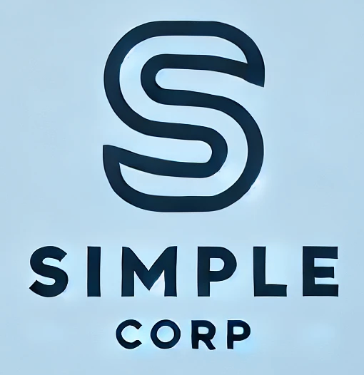

# simple

## Responsive Landing Page Framework Documentation

## Overview
This framework allows you to create responsive landing pages quickly and easily, utilizing HTML, CSS, and minimal JavaScript/jQuery. The design adapts to light and dark modes based on the user's operating system settings.

## Features
- **Responsive Grid System**: Predefined grid classes for flexible layout management.
- **Light/Dark Mode**: Automatically adapts to the user's OS theme preferences.
- **Sticky Navigation**: Header remains at the top of the page during scrolling.
- **Expandable Navigation**: Hamburger menu for mobile view, showing a dropdown navigation menu.
- **Customizable Brand Colors**: Easily adjustable brand color scheme.

## Grid System
Use `.row` and `.row-[number]` classes to create responsive grid layouts.

- `.row`: Default to three equal-width columns.
- `.row-1` to `.row-12`: Define columns ranging from one to twelve.

## Light/Dark Mode
The framework uses CSS variables to define light and dark color schemes:

- **Light Mode**:
  - Background: #f0f0f0
  - Text: #333
- **Dark Mode**:
  - Background: #333
  - Text: #eee

The brand color remains the same across both modes.

## Navigation
- The header contains a logo, navigation links, and a call-to-action button.
- On smaller screens, the navigation links are hidden and replaced with a hamburger menu. Clicking the menu icon toggles the dropdown menu.

## Customization
You can easily adjust the framework to fit your brand's color scheme by modifying the CSS variables defined in the `:root`.

## Usage
1. **Include the CSS**: Add the framework's CSS file to your project.
2. **Set Up HTML Structure**: Use the predefined classes for grid and navigation.
3. **Customize Colors**: Adjust the CSS variables in the `:root` to fit your brand.

## Example HTML Structure
```html
<header>
    <nav>
        <div class="nav-container">
            <div class="logo">
                
            </div>
            <ul class="nav-links">
                <li><a href="#home">Home</a></li>
                <li><a href="#about">About</a></li>
                <li><a href="#services">Services</a></li>
                <li><a href="#contact">Contact</a></li>
            </ul>
            <div class="extra-elements">
                <button class="cta-button">Get Started</button>
            </div>
            <div class="menu-icon">
                <span></span>
                <span></span>
                <span></span>
            </div>
        </div>
    </nav>
</header>

<section id="home" class="section">
    <div class="container">
        <h1>Welcome to Our Landing Page</h1>
        <p>This is a simple, responsive landing page framework.</p>
    </div>
</section>

<section id="about" class="section">
    <div class="container">
        <h2>About Us</h2>
        <p>Learn more about our mission and values.</p>
        <div class="row">
            <div>
                <h3>Our Mission</h3>
                <p>Our mission is to provide the best services to our customers.</p>
            </div>
            <div>
                <h3>Our Vision</h3>
                <p>We envision a world where our solutions make lives better.</p>
            </div>
        </div>
    </div>
</section>

<section id="services" class="section">
    <div class="container">
        <h2>Our Services</h2>
        <p>Discover the services we offer.</p>
        <div class="row">
            <div>
                <h3>Consulting</h3>
                <p>We provide expert consulting services to help you succeed.</p>
            </div>
            <div>
                <h3>Development</h3>
                <p>Our development team builds robust and scalable solutions.</p>
            </div>
            <div>
                <h3>Support</h3>
                <p>We offer 24/7 support to ensure your operations run smoothly.</p>
            </div>
        </div>
    </div>
</section>

<section id="contact" class="section">
    <div class="container">
        <h2>Contact Us</h2>
        <p>Get in touch with us today.</p>
        <form>
            <input type="text" placeholder="Name" required>
            <input type="email" placeholder="Email" required>
            <textarea placeholder="Message" required></textarea>
            <button type="submit">Send</button>
        </form>
    </div>
</section>

<footer>
    <p>&copy; 2024 Your Company. All rights reserved.</p>
</footer>
```

## JavaScript for Navigation
Include the following jQuery script for handling the navigation toggle:

```javascript
$(document).ready(function(){
    $('.menu-icon').on('click', function(){
        $('.nav-links').toggleClass('active');
    });

    $('nav ul li a').on('click', function(e){
        e.preventDefault();
        var target = $(this).attr('href');
        var offset = $('header').outerHeight();
        $('html, body').animate({
            scrollTop: $(target).offset().top - offset
        }, 1000);
        $('.nav-links').removeClass('active');
    });
});
```

This documentation provides a simple overview of how to use the framework and customize it to fit your needs.
